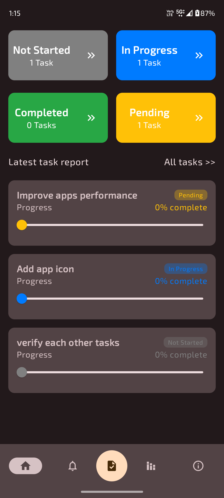
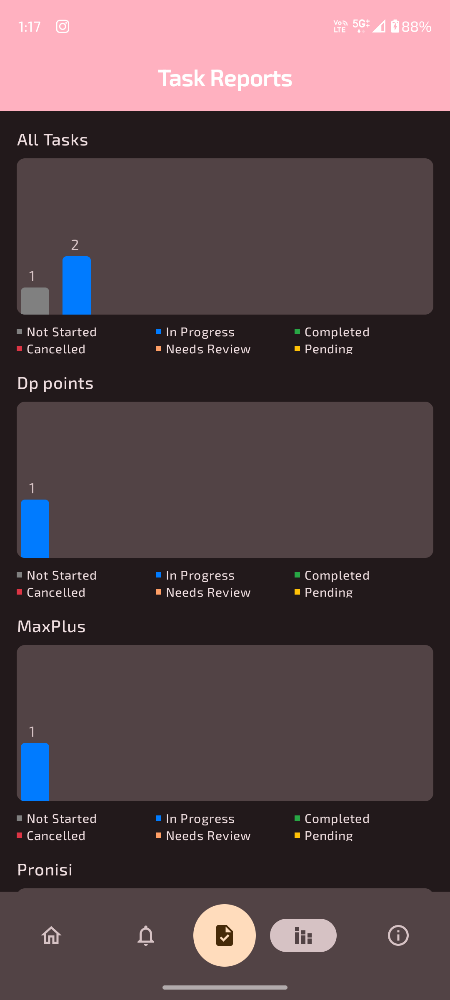

# Task Management

Task manager app that helps users organize their daily activities, set reminders, and track their progress. Include features like task categorization, due date reminders, and task completion status.

## Features

- Add, edit, and delete tasks
- Set reminders using Alarm Manager
- Organized task list with categories
- Intuitive UI with Jetpack Compose
- Dependency injection with Hilt
- MVVM architecture for a clean and maintainable codebase

## Documentation

### Task Status
- Not Started: The task has been created but has not yet been started.
- In Progress: Work on the task is currently underway.
- Completed: The task has been finished successfully.
- Cancelled: The task has been abandoned or cancelled.
- Needs Review: The task has been completed, but it requires review or verification.
- Pending: The task is pending further action or information before it can proceed.

### Task Priority
- Low: Tasks that are not urgent and can be completed at a later time.
- Medium: Tasks that are important but not critical and should be completed in a reasonable timeframe.
- High: Tasks that are urgent and need to be completed as soon as possible.
- Critical: Tasks that are extremely urgent and require immediate attention.
- Normal: Tasks that are of average priority, falling between low and high priority tasks.

### Screenshots

  
  
  

  
  
  

